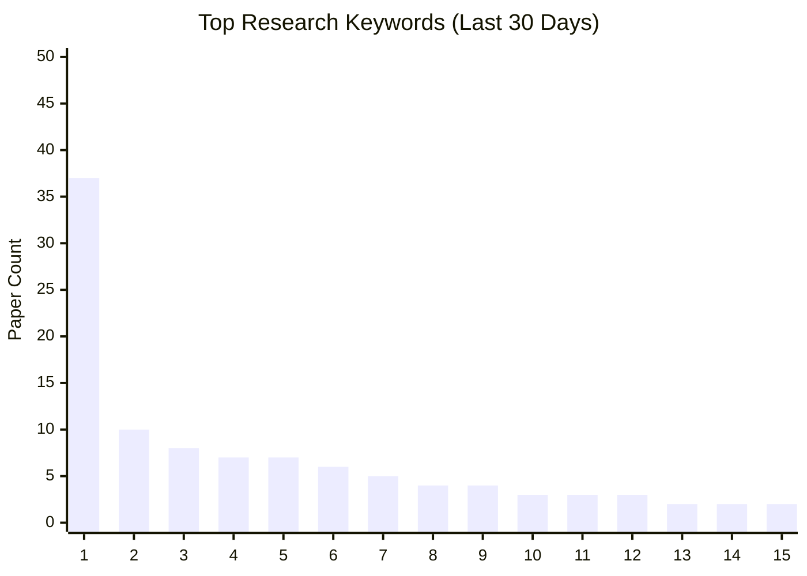
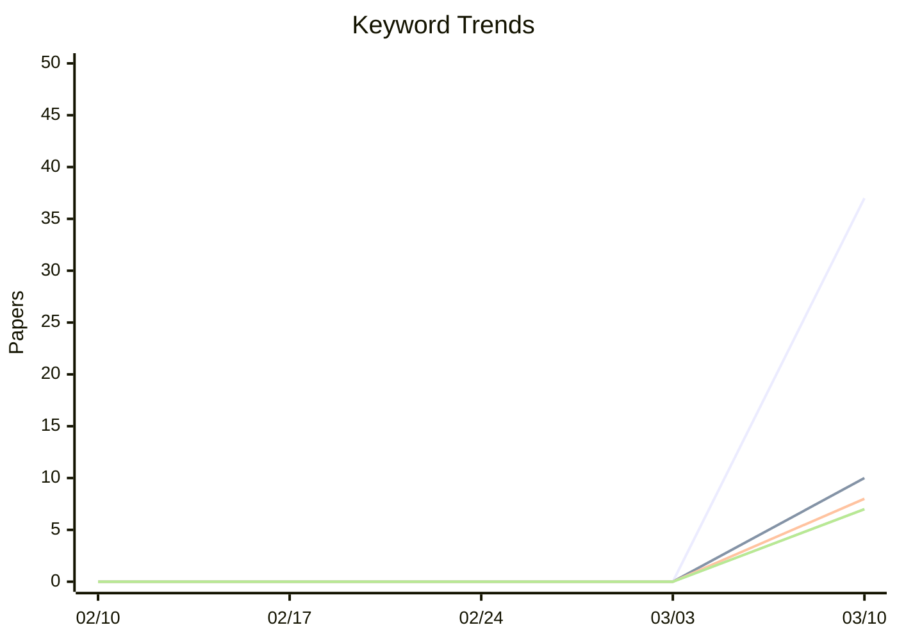

# 关键词趋势分析报告

> 生成日期: 2026-03-12
> 统计周期: 最近 30 天
> 关键词数量: 15 个

---

## 热门关键词排名

### 图例说明

| # | 关键词 | 论文数 | 类别 |
|---|--------|--------|------|
| 1 | quantum computing | 37 | quantum |
| 2 | open quantum systems | 10 | quantum |
| 3 | quantum information | 8 | quantum |
| 4 | quantum communication | 7 | quantum |
| 5 | quantum key distribution | 7 | quantum |
| 6 | quantum simulation | 6 | quantum |
| 7 | quantum error correction codes | 5 | quantum |
| 8 | entanglement | 4 | quantum |
| 9 | sagnac interferometer | 4 | quantum |
| 10 | quantum machine learning | 3 | machine_learning |
| 11 | quantum mechanics | 3 | quantum |
| 12 | indefinite causal order | 3 | quantum |
| 13 | gate fidelity | 2 | quantum |
| 14 | quantum fisher information | 2 | quantum |
| 15 | quantum networks | 2 | quantum |

## 关键词趋势变化

---
*本报告由 ArXiv Daily Researcher 关键词趋势模块生成 | 2026-03-12*
