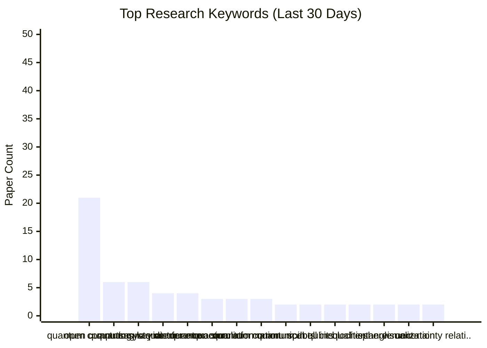
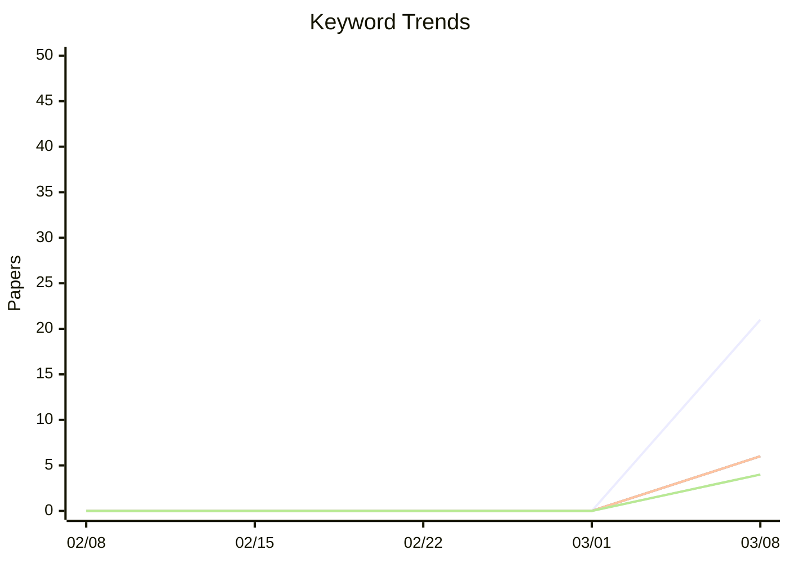

# 关键词趋势分析报告

生成日期: 2026-03-10

## 热门关键词排名

## 关键词趋势变化

## 统计表格

| Rank | Keyword | Count | Category |
|------|---------|-------|----------|
| 1 | quantum computing | 21 | quantum |
| 2 | open quantum systems | 6 | quantum |
| 3 | quantum key distribution | 6 | quantum |
| 4 | sagnac interferometer | 4 | quantum |
| 5 | quantum error correction codes | 4 | quantum |
| 6 | quantum simulation | 3 | quantum |
| 7 | quantum information | 3 | quantum |
| 8 | quantum communication | 3 | quantum |
| 9 | quantum dots | 2 | quantum |
| 10 | spin qubits | 2 | quantum |
| 11 | bell inequalities | 2 | quantum |
| 12 | bloch sphere | 2 | quantum |
| 13 | entanglement | 2 | quantum |
| 14 | visualization | 2 | general |
| 15 | uncertainty relations | 2 | quantum |
